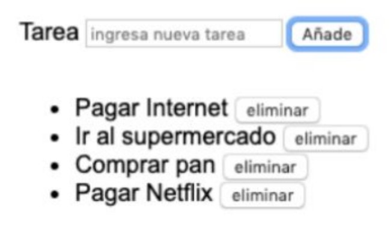
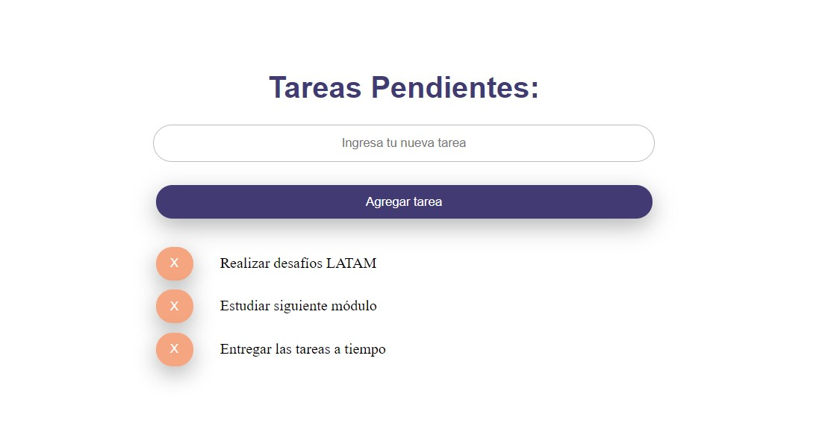

# 4_4-trabajando_con_props

Las props son elementos muy potentes en nuestros desarrollos, es por esto que debemos conocer cómo trabajar con ellas adecuadamente. En este caso, continuaremos con los elementos de listas de uno de los primeros desafíos de esta unidad, pero esta vez un poco más complejo, por lo que utilizaremos Comunicación de padre a hijo y viceversa.

Esta vez, se irán añadiendo elementos a la lista y por cada elemento creado, se debe dar la
opción de eliminar dicho elemento, al hacer esto, se debe eliminar de la lista, como se
muestra en las imágenes a continuación:

Lista:

Lista al eliminar una opción

## Instrucciones

1.  Generar un proyecto con Vue-Cli, donde se trabajaran con dos (2) componentes, Padre e Hijo.

1.  Desarrollar un formulario, en este se debe ingresar un texto y al pulsar un botón, este texto debe ser guardado en una lista.

1.  Métodos, cada vez que se pulsa el botón para guardar las tareas en una lista, se debe mostrar el elemento guardado y además pasar el elemento como props al componente hijo.

1.  Cada vez que pulsemos sobre el botón eliminar, se debe eliminar el ítem de la lista, pasando como atributo al padre, el índice del elemento a borrar o el texto completo.

## Resultado

