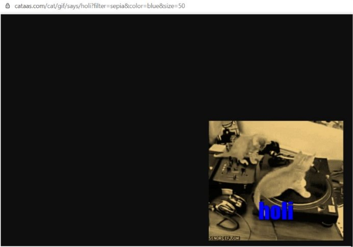
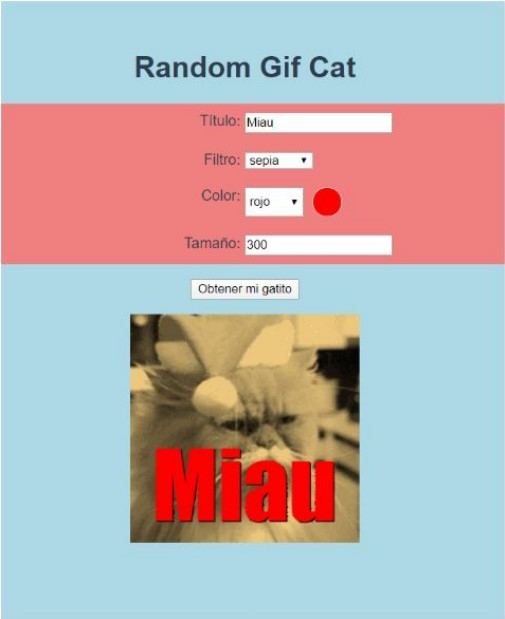

# 4_6-random_gif_cat

## Descripción

En este desafío, usted deberá desarrollar un sitio con tecnología Vue.js que sea capaz de consumir una API Restful, que es capaz de retornar un GIF personalizable acerca de gatos.
La API es: [cataas.com]:https://cataas.com/#/

Para esto, usted deberá hacer uso de la API mencionada a través del método integrado fetch de JavaScript. La dirección específica que debe consumir es la siguiente: [cat/gif]:https://cataas.com/cat/gif/says/holi?filter=sepia&color=orange&ize=40&type=or

Donde:

- _Título:_ Es un mensaje que aparecerá escrito por encima del GIF del gato. Por ejemplo, miau.

- _Filtro:_ Corresponde al filtro gráfico que se le aplicará al GIF, que puede ser alguno de los siguientes valores: _blur, mono, sepia, negative, paint, pixel._

- _Color:_ Corresponde al color que se le aplicará al título (primer punto). El color debe estar definido en minúsculas y en inglés. Por ejemplo, para definir el color verde, se debe especificar el valor _green_.

- _Tamaño:_ Corresponde al tamaño del título (primer punto). Este tamaño debe ser un valor entero, por ejemplo, _400_. Al consultar la API, obtendremos una respuesta como la siguiente:

Lo que se le solicita a usted es que pueda disponibilizar un sitio donde estos parámetros puedan ser especificados por el usuario y, al presionar un botón, se consuma la API y se
muestre el resultado en la vista de Vue.js, como en la siguiente imagen:

## Requerimientos

- El _título_ debe ser especificado por el usuario mediante una caja de texto

- El _filtro_ debe elegirse mediante una lista desplegable `<select>`, con los valores ya
  mencionados.

- El _color_ debe elegirse mediante una lista desplegable `<select>` con, a lo menos, 5 colores que deben ser presentados al usuario en español, ejemplo: rojo, azul, verde,
  blanco, amarillo. Además, debe desplegar una circunferencia que cambie de color en función del color seleccionado.

- El _tamaño_ debe ser especificado por el usuario mediante una caja de texto que sólo admite valores numéricos. Se debe implementar un botón llamado _Obtener mi gatito_ o con algún nombre descriptivo. Éste, al ser presionado, debe cargar en pantalla un GIF desde la API descrita anteriormente con los parámetros mencionados en este apartado.

- La interfaz de usuario debe verse exactamente como se muestra en la imagen anterior.

## Instrucciones

1. Crear un proyecto de Vue funcional, capaz de mostrarse en un navegador.

1. Desarrollo del formulario para la obtención del título, filtro, color, tamaño y botón de acción.

1. Desarrollo de la circunferencia que cambia en función del color seleccionado.

1. Consumo correcto de la API con los parámetros requeridos.

1. Despliegue del GIF obtenido desde la API.

1. Desarrollo del estilo gráfico del sitio como se le solicita.

# Resultado

