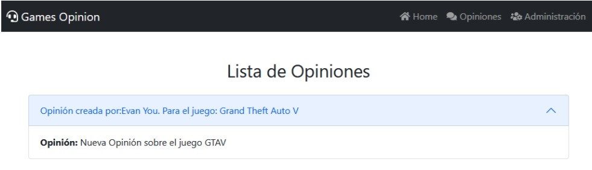
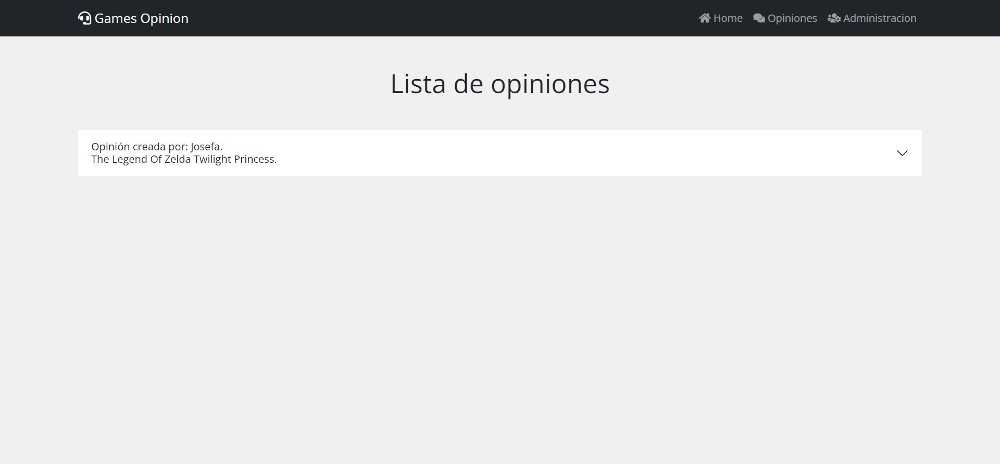

# Prueba - Games Opinion Site

- Para realizar esta prueba debes haber estudiado previamente todo el material disponible en el LMS correspondiente al módulo.
- Una vez terminada la prueba, comprime la carpeta que contiene el desarrollo de los requerimientos solicitados y sube el .zip en el LMS.
- Puntaje total: **10 Puntos**
- Desarrollo prueba: Individual.

## Habilidades a evalua

- Crear un entorno de desarrollo para Vue.js.
- Desarrollar la aplicación web en base a componentes.
- Implementar el ciclo de vida, eventos y directivas propias de Vue.js para manipular y controlar el contenido de la aplicación.
- Utilizar Vue Router para controlar rutas y redireccionamientos.
- Desarrollar una aplicación web que utilice Vuex para almacenar y modificar estados.
- Implementar pruebas unitarias a los componentes y Vuex
- Utilizar testing end-to-end para realizar pruebas globales.

## Descripción

Games Opinion (GO) es una empresa que se caracteriza por comercializar los últimos juegos para distintas plataformas de entretenimiento, como PC, Xbox, PS, entre otras. Por lo que decidió tomar la iniciativa y crear un nuevo sitio web para que sus clientes puedan opinar sobre los juegos más actuales, logrando así captar nuevos clientes y mejorar la distribución.

En este sentido, la empresa solicita crear un proyecto con Vue.js que utilice un JSON local para la renderización de datos. Igualmente, la empresa solicita que se trabaje con rutas dinámicas y estáticas que se apliquen a un estado centralizado para la información, donde cada opinión emitida pueda ser editada o eliminada por el mismo usuario.

Así mismo, el sitio web debe permitir que el usuario realice una opinión sobre cualquier juego mostrado en la página inicial mediante una ventana modal. Mientras que en las vistas de administración y opiniones se deben mostrar todas las opiniones

## Requerimientos:

1. Crear el proyecto mediante el entorno de desarrollo de Vue-CLI con todas las dependencias necesarias para el desarrollo de esta prueba. **(1 Punto)**
1. Utilizar componentes para lograr un desarrollo modularizado de la aplicación. **(2 Puntos)**
1. Implementar el ciclo de vida de los componentes, eventos y directivas propias de Vue.js para manipular y controlar el contenido de la aplicación. **(2 Puntos)**
1. Utilizar Vue Router para controlar rutas y redireccionamientos. **(2 Puntos)**
1. Desarrollar el sitio web utilizando Vuex para almacenar y modificar los estados. **(3 Puntos)**
1. Implementar por lo menos 2 pruebas unitarias a la aplicación. **(Opcional)**
1. Aplicar testing end-to-end para realizar pruebas globales. **(Opcional)**

El JSON que deberás consumir en esta prueba estará disponible en el archivo **“Apoyo Prueba - Games Opinion Site”** que se encuentra entre los documentos de esta sesión. Siéntete libre de agregar más videojuegos al archivo JSON si deseas, siguiendo la misma estructura de datos.

Te recomendamos utilizar LocalStorage para persistir la información que el usuario gestione o bien utilizar el plugin [Vuex Persisted](https://www.npmjs.com/package/vuex-persistedstate) State para automatizar la persistencia del estado global.

## Diseño del Sitio Web

## Resultado

